# design-patterns-samples

各種デザインパターンを活用したサンプルコード

## template-method



起動

```console
yarn ts-node-dev --respawn template-method/application.ts
```

リクエスト

```console
curl localhost:3000
curl localhost:3000/tasks
curl localhost:3000/users
```
