# design-patterns-samples

各種デザインパターンを活用したサンプルコード

## 継承



起動

```console
yarn ts-node-dev --respawn inheritance/application.ts
```

リクエスト

```console
curl localhost:3000
curl localhost:3000/tasks
curl localhost:3000/users
```

## 移譲


起動

```console
yarn ts-node-dev --respawn delegation/application.ts
```

リクエスト

```console
curl localhost:3000
curl localhost:3000/tasks
curl localhost:3000/users
```

## DB アクセスをインメモリ化したテスト


```console
yarn test
```
